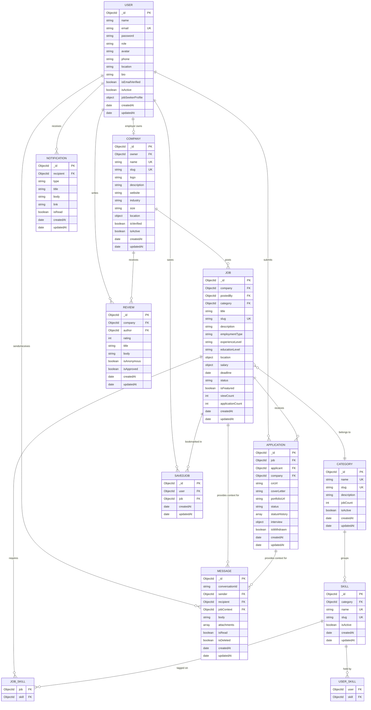

# SiraHub — Entity Relationship Diagram

## Mermaid ERD

Render this diagram at [mermaid.live](https://mermaid.live) or any Mermaid-compatible viewer.

---

## Relationship Narrative

### User → Company (One-to-One for Employers)
An employer (`role = 'employer'`) creates exactly one Company document. The `Company.owner` field holds the User's ObjectId. A job seeker does not have a Company.

### Company → Job (One-to-Many)
A Company can have many Job postings. `Job.company` references the Company. `Job.postedBy` references the employer User directly (useful for queries without a company join).

### Job → Category (Many-to-One)
Each Job belongs to exactly one Category. Categories are managed by admins.

### Job → Skill (Many-to-Many — embedded in Job)
A Job has an array of Skill ObjectIds (`skills: [ObjectId]`). Mongoose populates these on demand. A Skill can belong to many Jobs.

### User → Skill (Many-to-Many — embedded in User profile)
A Job Seeker's profile contains an array of Skill ObjectIds (`jobSeekerProfile.skills`). Same Skills collection is reused.

### User → Application (One-to-Many)
A Job Seeker can submit many Applications. Each Application references both the `Job` and the `applicant` (User). The `{ job, applicant }` combination is unique — no duplicate applications.

### Application → Company (Denormalized)
`Application.company` stores the Company ObjectId at application time. This makes employer dashboard queries efficient without joining through Job.

### User → SavedJob (One-to-Many)
A Job Seeker can save many Jobs. `{ user, job }` is unique — no duplicate saves.

### User → Notification (One-to-Many)
Notifications are delivered to a specific User (`recipient`). Each notification has a `type` and an optional `link` for navigation.

### User → Message (Many-to-Many via conversationId)
Two Users exchange messages. The `conversationId` is a stable string key: `[userId1, userId2].sort().join('_')`. All messages in a thread share the same `conversationId`. Optional `jobContext` and `applicationContext` fields link the conversation to a specific job or application.

### User → Review → Company (Many-to-Many via Review)
A Job Seeker writes Reviews for Companies. `{ company, author }` is unique — one review per user per company. The Review document bridges User and Company.

### Category → Skill (One-to-Many, optional)
Skills can optionally belong to a Category for grouping (e.g. "React" → "Software & IT"). This is advisory — skills can exist without a category.

---

## Index Strategy Summary

| Collection | Key Indexes |
|---|---|
| users | email (unique), role, isActive |
| companies | owner (unique), slug (unique), text(name+desc) |
| jobs | company, category, status, deadline, location.city, createdAt, text(title+desc) |
| applications | (job+applicant) unique, applicant, job, company, status |
| categories | slug (unique), isActive |
| skills | slug (unique), text(name), category |
| notifications | (recipient+isRead), (recipient+createdAt) |
| savedjobs | (user+job) unique, user+createdAt |
| reviews | (company+author) unique, company+createdAt |
| messages | (conversationId+createdAt), recipient+isRead |
